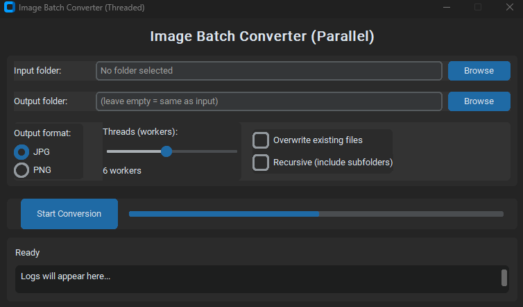
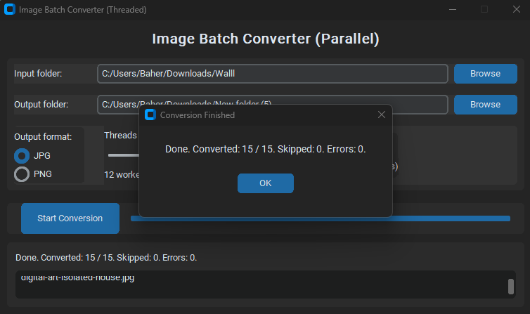

# 🖼️ Image Batch Converter (Threaded GUI)

A modern Python GUI application that converts all images in a selected folder to `.jpg` or `.png` format — fast and in parallel.

Built with [CustomTkinter](https://github.com/TomSchimansky/CustomTkinter) for a modern user interface and [Pillow](https://python-pillow.org) for image processing.

---

## ✨ Features

- ✅ Select input and output folders via GUI
- 🔁 Convert all supported images to **JPG** or **PNG**
- 🔍 Optional **recursive** conversion (includes subfolders)
- 🚀 **Multithreaded** for 3×–5× faster conversion using `ThreadPoolExecutor`
- 🧠 Smart handling:
  - Automatically skips existing files (unless overwrite is selected)
  - Converts color mode only if needed (e.g., RGB for JPG)
- 📁 Preserves folder structure when converting recursively
- ✅ Compatible with `.jpg`, `.jpeg`, `.png`, `.bmp`, `.gif`, `.tiff`, `.webp`
- 💡 Custom styled popup on completion
- 🧑‍💻 Clean, responsive interface with progress bar and real-time logs

---

## 📷 Preview

| Main Window                            | Completion Popup                      |
|----------------------------------------|----------------------------------------|
|     |  |

> *(You can take your own screenshots and save them in a `screenshots/` folder.)*

---

## 📦 Requirements

- Python 3.8+
- Modules:
  - `pillow`
  - `customtkinter`

Install with:

```bash
pip install pillow customtkinter
